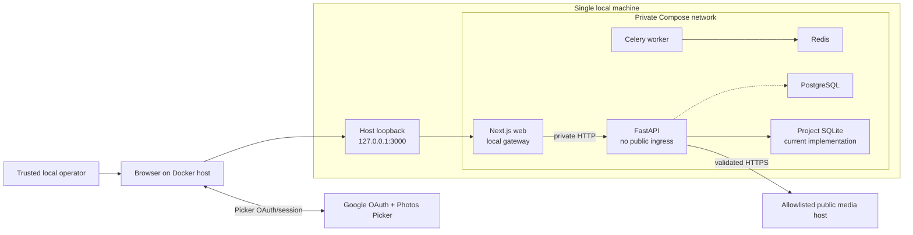
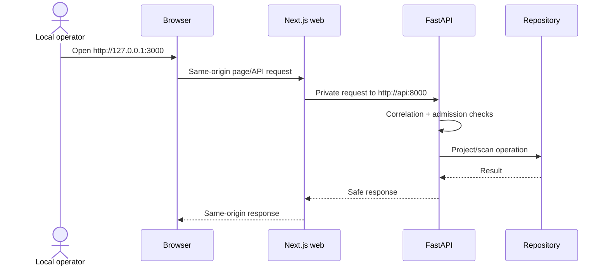
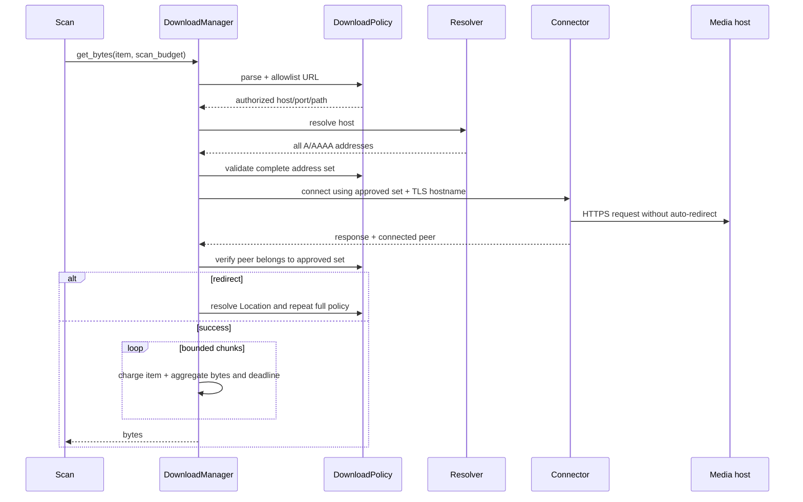

# PP-028 Localhost Security Boundary Architecture

## 1. Architecture Outcome

PP-028 uses a **local gateway architecture**. The Next.js web service is the only host-published
application component and Docker publishes it on `127.0.0.1` only. FastAPI, PostgreSQL, Redis, and
the worker remain reachable only on the private Compose network. The FastAPI application has no
user-authentication boundary and therefore is never a public ingress.

This architecture supports one trusted operator using a browser on the Docker host. It does not
support another device on the LAN, a reverse proxy, a tunnel, a hosted deployment, multiple users,
or an untrusted local OS account. Google Photos Picker OAuth remains browser-to-Google delegated
authorization for selected media. It is not a PhotoPrune login or an API credential.

The decision resolves the current deployment question without pretending that a network check is
tenant authorization. A future remote deployment must replace, not weaken, this architecture with
an approved identity/session/authorization and tenant-persistence design.

## 2. Scope and Decision Drivers

### In scope

- Shipped Docker Compose ingress and service networking.
- Strict API runtime settings and startup validation.
- Same-origin browser-to-web and private web-to-API request flow.
- API request admission safety fuses.
- Outbound media download SSRF, redirect, rebinding, size, and time controls.
- Safe error categories, correlation, and redaction.
- Compatibility handling for the existing non-null project owner column.
- Deterministic tests and a machine-checkable deployment boundary.

### Out of scope

- Accounts, sign-in, sessions, bearer tokens, CSRF design, or authorization policy.
- Tenant-aware repository queries, ownership migration, or row-level security.
- Reverse proxies, TLS termination, cloud hosting, LAN/mobile access, or remote workers.
- Replacing SQLite/PostgreSQL/Redis lifecycle decisions owned by PP-015 and PP-030.
- Distributed rate limiting or durable audit-log infrastructure.

### Drivers

1. All project and scan operations are currently unauthenticated.
2. CORS and Google OAuth cannot authorize PhotoPrune API operations.
3. Current Compose port publication makes internal services host-accessible on every interface.
4. Picker media URLs are caller-controlled outbound input and cross a high-risk network boundary.
5. The solution must be fail-closed, testable without live DNS, and small enough for the MVP.

## 3. System Context and Trust Zones



### Trust zones

| Zone                    | Trust assumption                                                | Allowed communication                                      |
| ----------------------- | --------------------------------------------------------------- | ---------------------------------------------------------- |
| Local operator/browser  | One trusted operator on the same host                           | Browser to `127.0.0.1:3000`; browser to Google             |
| Host loopback ingress   | Not remotely routable under shipped configuration               | Host loopback to published web port only                   |
| Private Compose network | Internal transport, not user authentication                     | Web to API; worker to Redis; services to configured stores |
| API process             | Receives only private gateway traffic in supported topology     | Repository access and validated outbound downloads         |
| Public media network    | Untrusted response and redirect source                          | API-initiated HTTPS only after all policy checks           |
| Host filesystem/state   | Trusted against the single operator, not against other OS users | Existing local persistence semantics only                  |

### Explicit non-boundaries

- A request `Host` or `Origin` header is untrusted metadata, not proof of loopback origin.
- Docker service names and private IPs identify routing, not users.
- `Authorization`, `X-User-Id`, `X-Forwarded-User`, and similar headers have no meaning in PP-028.
- A project UUID is an object identifier, not a secret capability.
- The existing `local-user` database value is a schema compatibility sentinel, not a principal.

## 4. Container and Ingress Architecture

### 4.1 Effective topology

The base and development Compose files must converge to this host publication policy:

| Service    | Container listener              | Host publication      | Reason                                |
| ---------- | ------------------------------- | --------------------- | ------------------------------------- |
| `web`      | `0.0.0.0:3000` inside container | `127.0.0.1:3000:3000` | Sole local gateway                    |
| `api`      | `0.0.0.0:8000` inside container | None                  | Reachable by `web` on private network |
| `postgres` | Default container listener      | None                  | No current host ingress requirement   |
| `redis`    | Default container listener      | None                  | Worker-private infrastructure         |
| `worker`   | None                            | None                  | Background process only               |

An internal `0.0.0.0` listener is required for sibling-container traffic and is not itself a host
exposure. Security depends on the effective host port bindings, not on grepping Dockerfile command
text.

### 4.2 Request flow



Browser application calls use Next route handlers rather than a browser-visible API host. Server
forwarding uses `INTERNAL_API_BASE_URL=http://api:8000`. `PHOTOPRUNE_API_BASE_URL` must not cause a
browser to bypass the gateway in the shipped topology. Existing health UI behavior must be routed
same-origin or explicitly documented as development-only before the API host port is removed.

Concretely, `apps/web/app/api/_lib/backend.ts` prefers `INTERNAL_API_BASE_URL` and falls back to the
loopback API URL only for the documented non-container development path. A new same-origin
`apps/web/app/api/health/route.ts` uses that helper to forward `/healthz`, and the client health page
fetches `/api/health`. Proxy/helper and health tests run with only the internal URL configured. This
is part of the topology change: removing the API publication without updating these paths would
break project proxies and leave the health page calling an unreachable browser URL.

### 4.3 Deployment boundary checker

Add `scripts/check-deployment-boundary.mjs` and expose it as
`pnpm check:deployment-boundary`. The checker runs `docker compose ... config --format json` where
supported, or consumes a checked JSON fixture in unit tests. It evaluates the effective merged
configuration rather than individual YAML text.

The policy is:

1. `web` has exactly the documented TCP publication for container port 3000.
2. Its host IP is the literal IPv4 loopback `127.0.0.1`.
3. No publication uses an omitted host IP, `0.0.0.0`, `::`, `[::]`, a wildcard, a hostname, or a
   different address.
4. `api`, `postgres`, and `redis` have zero published ports.
5. Development overrides cannot relax any base-file rule.

IPv4 loopback is deliberately canonical for this task. Supporting IPv6 loopback would require the
web server, Compose publication, browser URLs, origin validation, and tests to agree; do not add it
incidentally while merely rejecting IPv6 wildcard exposure.

## 5. Runtime Configuration Architecture

### 5.1 Typed settings

Use string enums in `apps/api/app/core/config.py`:

```text
DeploymentMode = local_only
RuntimeEnvironment = local | test | production
```

`deployment_mode` may default to the only safe supported value, `local_only`. `environment` keeps
the existing safe default `local`. Values are exact after surrounding whitespace is rejected or
normalized by one documented rule; do not scatter `.lower() == "prod"` checks. Unknown values fail
Pydantic settings creation.

### 5.2 Validation phases

1. **Field parsing:** enum values, positive numeric types, normalized host/origin lists.
2. **Cross-field policy:** the download allowlist is deny-all when empty in every environment;
   production overrides are forbidden; CORS is local or explicitly disabled; configured maxima
   cannot exceed hard safety ceilings.
3. **Application construction:** `create_app()` obtains one validated settings snapshot before
   middleware, repositories, or routes become available.
4. **Launcher policy:** the Compose checker separately proves socket publication. API settings do
   not claim to validate host networking they cannot observe.

This separation prevents a common false guarantee: application configuration can fail closed, but
it cannot prove how an orchestrator published its socket.

The shipped local environment supplies the narrow Google media allowlist required for Picker scans.
Tests and deterministic local fixtures explicitly supply their own allowed original hostname.
`scan_download_host_overrides` changes routing only after the original name passes the allowlist; it
does not turn an empty list into allow-all. This invariant applies to `local`, `test`, and
`production`, so the default supported mode cannot retain arbitrary outbound HTTPS access.

### 5.3 CORS policy

CORS remains defense in depth for direct development calls only. Production origins are an explicit
set of `http://localhost:<allowed-port>` and/or `http://127.0.0.1:<allowed-port>` origins. Wildcards,
userinfo, paths, queries, fragments, non-loopback hosts, and `null` are invalid. If all supported
browser calls are same-origin after implementation, production CORS may be empty only if the API has
no browser-direct route and startup policy explicitly models CORS as disabled rather than as an
empty allow-all list.

This refines the implementation specification: **non-empty CORS is not intrinsically safer**. The
builder must select either explicit local origins for a proven direct-browser need or disabled CORS
for a wholly same-origin gateway flow. Empty must never be interpreted as wildcard.

## 6. API Boundary and Admission Architecture

### 6.1 Middleware order

Outermost to innermost:

1. Correlation ID validation/generation and response propagation.
2. Safe exception translation and redacted structured logging.
3. Pure ASGI inbound-body limiter wrapping the request `receive` channel.
4. General non-health request admission fuse.
5. Existing CORS middleware, if enabled.
6. Router dependencies, bounded-body JSON parsing, Pydantic validation, and handlers.

Scan-specific admission wraps only actual scan execution and releases concurrency in a `finally`
path. Request parsing failures must not consume a long-lived scan slot. Health endpoints bypass rate
fuses but remain minimal.

### 6.2 Inbound body and field boundary

The application enforces a **32 MiB maximum inbound HTTP request body** before FastAPI parses JSON.
A pure ASGI middleware checks a valid `Content-Length` before reading and wraps `receive` to count
actual `http.request` body chunks. It terminates at the first byte over the ceiling and returns a
safe `413 request_body_too_large` without calling the downstream application. Missing, malformed,
duplicated, or understated length headers never disable streamed accounting. The implementation
must not use a convenience middleware that materializes the entire body before applying the check.

This pre-parse ceiling is paired with immediate post-parse schema limits:

| Input                              |          Maximum |
| ---------------------------------- | ---------------: |
| Request body                       |           32 MiB |
| Identifier/source-reference string |   512 characters |
| Filename                           | 1,024 characters |
| MIME type                          |   255 characters |
| Download URL or deep link          | 4,096 characters |
| Review note                        | 4,096 characters |
| Photo/Picker items                 |            2,000 |

Replace `picker_payload: dict[str, Any]` and unbounded scan `source_ref`/media-item dictionaries with
explicit input models for the supported Picker and source shapes. Those boundary models use
`extra="forbid"`, bounded strings and lists, and no recursively arbitrary values. Response and
persisted-envelope dictionaries are not automatically in scope; constrain only caller-controlled
request shapes in PP-028. URL length is checked by schema validation before parsing, resolution, or
connection policy. Tests instrument the downstream parser/handler to prove it is never invoked for
declared or streamed oversized bodies.

### 6.3 Local safety fuses

The limits in the implementation specification are initial hard ceilings, not product capacity
claims. Implement injectable interfaces:

```text
Clock.now_monotonic() -> float
RequestLimiter.admit(scope) -> Admission
ScanConcurrency.acquire() -> Lease | Busy
Lease.release() -> None
```

Use process-local state guarded for concurrent FastAPI execution. Do not key it from forwarded
headers because no trusted reverse proxy exists. The general limiter is process-wide. The scan
limiter counts logical scan admissions and the concurrency lease covers synchronous scan work.

Return stable categories and HTTP semantics:

| Condition                     | Status | Required response metadata                           |
| ----------------------------- | -----: | ---------------------------------------------------- |
| General or scan rate exceeded |    429 | Integer `Retry-After`, correlation ID, safe category |
| Scan execution already active |    503 | `Retry-After`, correlation ID, `scan_busy`           |
| Input/work ceiling exceeded   |    422 | Correlation ID and relevant safe budget category     |

These controls mitigate accidental local overload. They are not authentication, fairness between
users, or denial-of-service protection against a hostile local process.

### 6.4 Identity-header handling

Do not add middleware that parses or trusts identity-like headers. Tests send spoofed values and
assert behavior is identical to requests without them. Logging must not preserve bearer values.

The repository may replace the default parameter with an internal constant:

```text
SINGLE_OPERATOR_STORAGE_OWNER = "local-operator"
```

Changing the persisted value is not required and may create migration churn. If existing rows and
schema use `local-user`, retain that exact stored sentinel and only rename the code abstraction.
Routes never accept it, return it as an authenticated identity, or filter access based on a header.

## 7. Outbound Download Architecture

### 7.1 Component decomposition

Refactor `apps/api/app/engine/downloads.py` around small injectable protocols without adding a new
HTTP dependency unless implementation proves the standard library cannot preserve TLS correctly:

```text
DownloadPolicy
  parse_and_authorize(url, environment) -> AuthorizedTarget

Resolver
  resolve(host, port) -> NonEmptySet[IPAddress]

Connector
  open_https(target, approved_addresses, timeout) -> ConnectedResponse

RedirectController
  next_target(response, current_url, history) -> URL | Complete

DownloadBudget
  charge_attempt()
  charge_bytes(count)
  check_deadline()
```

`ConnectedResponse` must expose the peer IP so policy can compare it to the approved resolution set.
The TLS connection must still verify the certificate and SNI against the original allowlisted
hostname, not the selected IP literal.

### 7.2 Download sequence



### 7.3 URL policy

For every initial and redirected target:

- Parse once into an immutable normalized target.
- Allow HTTPS only, except an explicit test/local fixture override path that cannot validate in
  production.
- Reject userinfo, fragments, missing host, malformed IPv6, ambiguous Unicode/IDNA forms, and ports
  other than the policy-approved port.
- Match exact hosts. The existing Google media policy token may match only
  `lh<digits>.googleusercontent.com`; it is not a general suffix wildcard.
- Resolve relative `Location` against the current URL, then repeat every policy step.
- Detect repeated normalized targets and stop, even before the three-redirect ceiling.

Do not put full URLs in exception messages. Internally retain only the normalized hostname and an
opaque item/correlation reference required for diagnosis.

### 7.4 DNS and connection policy

Validation of `socket.getaddrinfo()` followed by an ordinary hostname connection is insufficient
because the HTTP library may resolve again. The connector must ensure the connection uses an IP from
the exact approved resolution set and must verify the actual peer after connect.

Reject the entire resolution when:

- there are no A/AAAA results;
- any address is non-global under `ipaddress` policy;
- address parsing or family handling is ambiguous; or
- the connected peer is absent from the approved set.

Do not fall back from a rejected address to an unvalidated result. Re-resolving for each redirect or
retry creates a new approved set; a new set never retroactively authorizes an existing connection.

### 7.5 Redirects and retries

Disable library auto-redirect behavior. Accept only 301, 302, 303, 307, and 308 as redirects with a
single valid `Location`. Picker downloads are GET-only, so method rewriting is not relevant.

PP-028 does not add automatic network retries. A retry policy would consume additional DNS,
connection, time, and byte budget and requires a separate decision. The three-redirect limit counts
transitions after the initial request; at most four HTTP requests can occur per item.

### 7.6 Budget ownership

Budgets have two lifetimes:

- `ItemDownloadBudget`: per logical item, including redirect response bytes and failed attempts.
- `ScanDownloadBudget`: shared by every item in one scan, including failures and duplicates that
  caused network work.

The scan layer creates one aggregate budget and passes it through `DownloadManager`. The manager's
cache may avoid charging network bytes twice, but duplicate media IDs/URLs cannot reset aggregate
counters. Check `Content-Length` when present, then enforce actual streamed bytes regardless of the
header. Use a monotonic deadline and check it before DNS, before connect, after headers, and between
chunks.

### 7.7 Response handling

Only a successful 2xx response is eligible for image-byte collection. Redirect bodies are not
collected beyond a small fixed discard ceiling. Other status bodies are never included in errors or
logs. Content type remains advisory; the existing image decoder is the authoritative validation,
but clearly non-image responses may fail earlier without echoing the header value if it is unsafe.

## 8. Error and Observability Architecture

### 8.1 Error envelope

Use the repository's existing response conventions where possible. Security failures expose:

```json
{
  "detail": {
    "category": "download_address",
    "message": "The selected photo could not be retrieved safely.",
    "correlationId": "opaque-id"
  }
}
```

Do not add a shared cross-service schema solely for internal security errors unless web behavior
needs to branch on it. If the UI only displays the message, keep categories API-internal and test
the adapter's fallback behavior.

### 8.2 Structured log fields

Allowed:

- correlation ID;
- stable category;
- route template and status;
- normalized allowlisted hostname when operationally necessary;
- counters such as bytes charged, redirect count, and elapsed bucket.

Forbidden:

- raw URL, path, query, fragment, or userinfo;
- OAuth/access tokens, cookies, authorization headers, or API keys;
- request/response bodies and upstream body snippets;
- full exception strings from URL/network libraries before sanitization;
- project names, filenames, or media IDs unless separately justified and redacted.

### 8.3 Correlation IDs

Accept an inbound correlation ID only if it matches a short conservative character/length policy;
otherwise generate one. Since there is no trusted proxy, correlation IDs have observability value
only and no security authority. Return the final value on error responses and, if consistent with
existing API practice, all responses.

## 9. Architecture Decision Records

### ADR-028-1: Local gateway instead of incomplete authentication

- **Status:** Accepted for PP-028.
- **Decision:** Support one local operator and prohibit non-local ingress.
- **Rationale:** There is no identity/session/tenant architecture to secure a multi-user API.
- **Consequence:** Remote and multi-user use remain blocked; network containment is release-critical.
- **Rejected alternative:** Treat Google OAuth as login. It authorizes Picker media and does not
  establish an API principal/session.

### ADR-028-2: Web is the sole published service

- **Status:** Accepted.
- **Decision:** Publish only Next.js at `127.0.0.1:3000`; keep API and data services private.
- **Rationale:** One ingress is simpler to inspect and prevents browser/API topology drift.
- **Consequence:** Direct host API/database/Redis access is no longer a supported Compose workflow.
- **Rejected alternative:** Publish API on loopback too. It creates a second unnecessary ingress and
  allows browser code to bypass the same-origin gateway.

### ADR-028-3: Orchestrator policy and application policy are separate proofs

- **Status:** Accepted.
- **Decision:** Validate runtime settings at app construction and effective port publication with a
  Compose-aware checker.
- **Rationale:** Neither layer can prove the other's state.
- **Consequence:** Both checks are required; a green API test alone cannot approve deployment.

### ADR-028-4: Pin connection to an approved DNS result

- **Status:** Accepted.
- **Decision:** Connect through an approved address set, preserve TLS hostname verification, and
  inspect the connected peer.
- **Rationale:** Preflight DNS validation followed by library re-resolution is rebinding-prone.
- **Consequence:** The connector is more involved than `urllib.request.urlopen`; it must be isolated
  and heavily unit-tested.
- **Rejected alternative:** Resolve, validate, then call the existing hostname fetcher. This leaves a
  check-to-use gap.

### ADR-028-5: Process-local limits are safety fuses only

- **Status:** Accepted.
- **Decision:** Use bounded in-memory rate and concurrency controls for the single process/operator.
- **Rationale:** Distributed identity-aware limits are unnecessary and misleading in local-only mode.
- **Consequence:** Limits reset on restart and do not coordinate multiple API processes; multiple
  replicas are unsupported.

### ADR-028-6: Preserve the owner column only as a storage sentinel

- **Status:** Accepted pending PP-015 persistence work.
- **Decision:** Remove caller-facing/default-principal semantics but avoid a PP-028 schema migration.
- **Rationale:** Renaming a sentinel does not create authorization and migration is outside scope.
- **Consequence:** Existing stored `local-user` values may remain and must be documented internally as
  non-security data.

## 10. Implementation Slices

Implement in this dependency order so every slice remains reviewable:

### Slice A: Configuration and deployment proof

1. Add enums and cross-field startup validation.
2. Add configuration negative tests.
3. Change Compose publications and internal web API environment.
4. Add effective-Compose boundary checker and fixtures.
5. Update local deployment documentation.

Exit: unsupported modes/settings fail and the shipped effective topology exposes only loopback web.

### Slice B: Gateway and API admission

1. Confirm every browser project/scan call is same-origin.
2. Make the shared backend helper prefer `INTERNAL_API_BASE_URL`, add a same-origin health handler,
   and update the client health page and tests.
3. Remove direct browser API dependency from the supported path.
4. Add correlation/error and pre-parse body-limit middleware.
5. Replace arbitrary scan-input dictionaries with bounded, extra-forbidden request models.
6. Add general and scan-specific process-local fuses.
7. Add body/field-limit, proxy/health, spoofed-identity, and limiter tests.

Exit: only the local gateway reaches API, identity headers have no authority, and excess work is
bounded before scan execution.

### Slice C: Download policy and connector

1. Separate URL policy, resolver, connector, redirect controller, and budgets.
2. Disable automatic redirects.
3. Enforce complete DNS-set and connected-peer checks with TLS hostname preservation.
4. Add item and scan budgets.
5. Add deterministic SSRF, rebinding, redirect, size, deadline, and redaction tests.

Exit: no caller-selected target can reach a non-global peer or exceed a request budget.

### Slice D: Persistence semantics and final evidence

1. Replace misleading repository parameter defaults with an internal sentinel abstraction.
2. Confirm no route accepts or returns an authenticated owner claim.
3. Update architecture/deployment docs required by PP-028 without absorbing PP-032's full rewrite.
4. Run focused, full, docs, and deployment-policy gates.
5. Record builder and independent verifier evidence.

Exit: documentation, code, tests, and effective topology agree on local-only behavior.

## 11. Verification Architecture

### Test layers

| Layer                     | Required evidence                                                                      |
| ------------------------- | -------------------------------------------------------------------------------------- |
| Settings unit tests       | Exact enums; unsafe production combinations; safe non-secret failures                  |
| Compose policy unit tests | Public/omitted/IPv6 wildcard hosts; forbidden service ports; override regression       |
| Effective topology check  | Merged base + development Compose output passes                                        |
| ASGI/schema tests         | Declared/streamed 32 MiB ceiling before parse; bounded fields; unknown keys rejected   |
| Web proxy/health tests    | Internal-only base URL keeps project routes and same-origin health working             |
| Route tests               | Health bypass; 429/503 semantics; slot release; spoofed identity ignored               |
| Download unit tests       | URL parsing; redirects; mixed DNS; rebinding peer; TLS hostname; budgets; redaction    |
| Scan integration tests    | One aggregate budget; partial item failures remain truthful; total failure is explicit |
| Documentation guard       | Commands and localhost claims remain synchronized                                      |

No security test may require live DNS or a public media request. Resolver, connector, clock, and
limiter behaviors must be injected. The existing deterministic local fixture exception remains
test/local-only and must be rejected under production settings.

### Architecture fitness functions

The builder must add automated checks for these statements:

1. Effective shipped Compose publishes only `web` on `127.0.0.1:3000`.
2. No unsupported deployment mode constructs the API.
3. No environment interprets an empty download allowlist as allow-all, and production rejects fixture
   overrides.
4. No body above 32 MiB reaches JSON/model parsing, and no oversized field reaches scan work.
5. Internal-only API configuration keeps all project proxies and same-origin health working.
6. No outbound redirect occurs without a fresh URL, DNS-set, and peer validation.
7. No scan can exceed aggregate bytes, wall deadline, admission rate, or concurrency.
8. No captured response/log contains seeded URL tokens, credentials, or upstream body text.
9. No identity-like header changes repository selection or route outcome.

## 12. Risks and Mitigations

| Risk                                                | Mitigation                                                | Residual risk                                                  |
| --------------------------------------------------- | --------------------------------------------------------- | -------------------------------------------------------------- |
| A future Compose override republishes API           | Effective merged-config checker in the normal gate        | Ad hoc launch commands outside repo remain operator-controlled |
| Local malware calls loopback                        | Explicitly outside the one-trusted-operator model         | Local-only is not a desktop sandbox                            |
| DNS rebinding bypasses preflight                    | Approved-address connection plus peer inspection          | Resolver/connector implementation requires careful TLS review  |
| Process-local limiter is bypassed by replicas       | One API process is supported and documented               | Multiple replicas remain unsupported                           |
| Internal service is mistaken for authenticated      | Docs/tests state private routing is not identity          | Future remote work must replace the boundary                   |
| CORS is treated as security                         | Same-origin gateway and explicit non-boundary statements  | Misconfigured ad hoc launchers remain possible                 |
| Numeric ceilings are mistaken for capacity promises | Call them hard safety ceilings and test failure semantics | Performance suitability remains PP-029 work                    |
| Owner sentinel is mistaken for a principal          | Internal-only constant and spoofing tests                 | Schema cleanup remains coordinated with PP-015                 |

## 13. Builder Review Questions

Before implementation begins, the builder must confirm:

1. Do any current browser paths call FastAPI directly rather than a Next route handler? If yes,
   either route them through the gateway in Slice B or stop for architecture review.
2. Can the selected standard-library connector both pin an approved address and preserve certificate
   and SNI verification? If not, propose the smallest justified dependency or connector design for
   renewed review; never disable TLS verification.
3. Does removing host-published PostgreSQL/Redis/API break a documented required workflow? If yes,
   use explicit one-shot `docker compose exec` guidance rather than republishing ports.
4. Which existing error envelope can carry stable safe categories without unnecessary shared-schema
   churn?
5. Can every limiter and deadline test use injected monotonic time with no sleeps?
6. Can the ASGI body limiter demonstrate that downstream JSON parsing is not invoked for both a
   declared oversized body and a chunked/understated oversized body?

Any answer that requires remote ingress, authentication, a reverse proxy, tenant persistence, TLS
verification bypass, or a higher resource ceiling changes the approved scope and requires renewed
architecture review.
